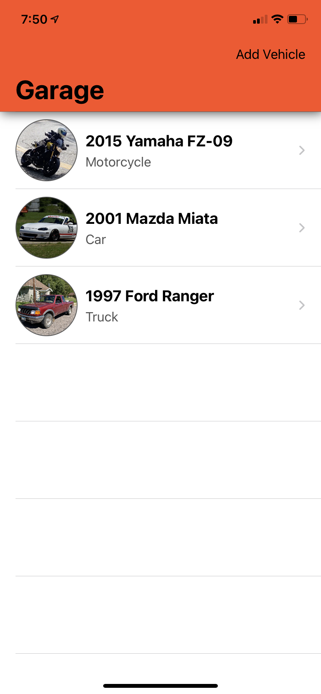
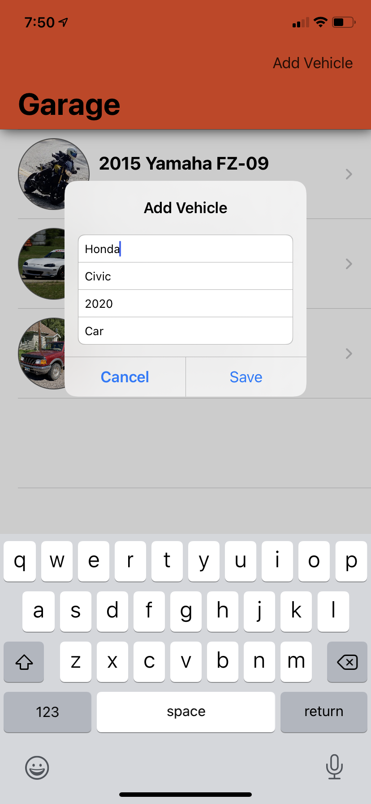
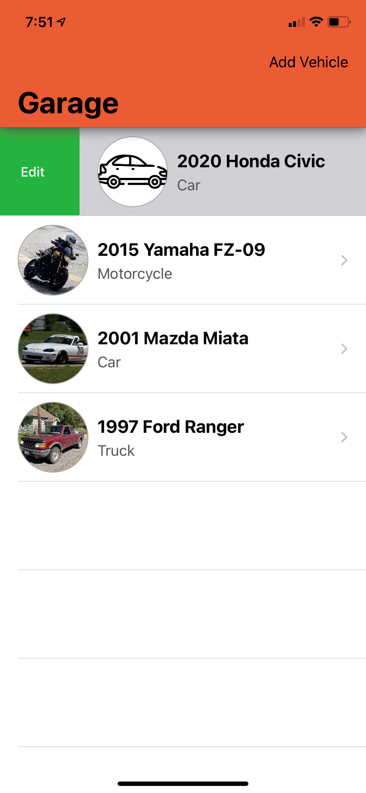
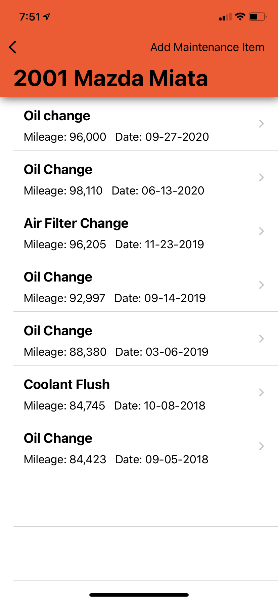
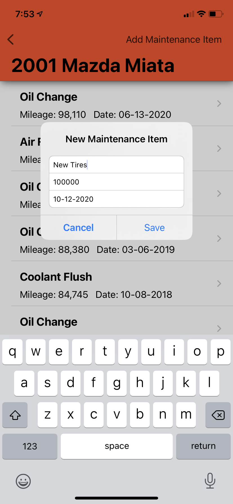

# Maintenance-Tracker
iOS app for tracking maintenance performed on many vehicles.

## Usage

|  |  |
|--|--|
||The homepage or "Garage" allows users to view the vehicles they have saved.|
||The "Add Vehicle" button in the upper right corner allows users to specify information for a new vehicle.|
||Users can swipe right on a vehicle to edit it's information or add a thumbnail image using UIImagePicker. Users can also swipe left to delete a vehicle.|
||Tapping on a vehicle brings up the maintenance items associated with that vehicle.|
||The "Add Maintenance Item" button in the upper right corner allows users to create a new maintenance item with the specified fields. Users can also delter maintenance items by swiping left.|
||Tapping a maintenance item opens a detail view that allows users to add or update a description for the maintenance item.|
